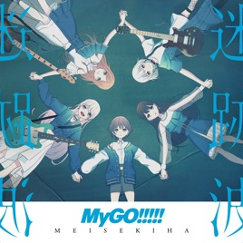

Hello! I am sharing some bass tabs that I have created myself :blush:.  
Most of them are my own transcriptions, while the rest are compiled from online sources (with the origins marked within the files).  
These tabs have been carefully organized and formatted by me to enhance readability and facilitate ease of performance.  
The tabs that I have personally transcribed include the original extracted bass audio, so if you are uncertain about any of the notes, you can cross-reference the audio for verification.  

I will be providing updates on the progress of my transcription work.  
If there are any other songs you are interested in, please let me know in the issues section, and I will consider transcribing them, but cannot guarantee completion :sneezing_face:.  
Due to my personal preferences, the majority of these tabs are related to J-pop, Britpop songs, or anime songs.

If you utilize the tabs I have personally transcribed to perform and upload to public platforms, I would be most appreciative if you could provide proper attribution and cite me as the source :kissing_heart:.  
- github: [@Canjia-Huang](https://github.com/Canjia-Huang)  
- bilibili: [@JaeF7](https://space.bilibili.com/3041026?spm_id_from=333.1245.0.0)

However, providing attribution is not an absolute requirement, as the copyrights of the musical works do not lie with me.

I hope these tabs will be helpful to you.  
Simply enjoy the music!
# Usage
These tabs are all in the `.gp` format, which can be opened using [Guitar Pro](https://www.guitar-pro.com/) (version 8.0 or a later version) software.
# Tab Contents
## Programming :sob:
- 青春謳歌 - 山根绮 · 羊宫妃那 (2024.10.15)  
- Sing!Shine!Smile! - Liella! (...)  
- 音色の彼方 - 北宇治四重奏 (...)  
- おはよう、またあした - 放課後ティータイム (...)  
- presence - 楠木ともり (...)  
- シンゲツ - 楠木ともり (...)  

## [楠木ともり](https://music.apple.com/cn/artist/%E6%A5%A0%E6%9C%A8%E3%81%A8%E3%82%82%E3%82%8A/1520358732) :drooling_face:
<table> 
<tr>
<td></td>
<td>

[**PRESENCE**](https://music.apple.com/cn/album/presence/1682199460)
1. [アカトキ](tabs/楠木ともり/アカトキ.gp) [ :musical_note:](https://music.apple.com/cn/album/%E3%82%A2%E3%82%AB%E3%83%88%E3%82%AD/1682199460?i=1682199737)[ :movie_camera:](https://www.bilibili.com/video/BV1HY4y1m7n4/)
2. [もうひとくち](tabs/楠木ともり/もうひとくち.gp)[ :musical_note:](https://music.apple.com/cn/album/%E3%82%82%E3%81%86%E3%81%B2%E3%81%A8%E3%81%8F%E3%81%A1/1682199460?i=1682199738)[ :movie_camera:](https://www.bilibili.com/video/BV1C6421G76j/)
3. [ロマンロン](tabs/楠木ともり/ロマンロン.gp)[ :musical_note:](https://music.apple.com/cn/album/%E3%83%AD%E3%83%9E%E3%83%B3%E3%83%AD%E3%83%B3/1682199460?i=1682199746)[ :movie_camera:](https://www.bilibili.com/video/BV1vJ4m1J7Fw/)
4. [sketchbook (Live ver.)](tabs/楠木ともり/sketchbook%20(Live%20ver.).gp)[ :musical_note:](https://www.youtube.com/watch?v=_dUop5_xOmU)[ :movie_camera:](https://www.bilibili.com/video/BV1JH4y167GC/)
5. [ハミダシモノ](tabs/楠木ともり/ハミダシモノ.gp)[ :musical_note:](https://music.apple.com/cn/album/%E3%83%8F%E3%83%9F%E3%83%80%E3%82%B7%E3%83%A2%E3%83%8E/1682199460?i=1682199751)
6. [バニラ](tabs/楠木ともり/バニラ.gp)[ :musical_note:](https://music.apple.com/cn/album/%E3%83%90%E3%83%8B%E3%83%A9/1682199460?i=1682199753)[ :movie_camera:](https://www.bilibili.com/video/BV11h4y1W7kD/)
7. [タルヒ](tabs/楠木ともり/タルヒ.gp)[ :musical_note:](https://music.apple.com/cn/album/%E3%82%BF%E3%83%AB%E3%83%92/1682199460?i=1682199761)[ :movie_camera:](https://www.bilibili.com/video/BV1gh4y187zB/)
8. [alive](tabs/楠木ともり/alive.gp)[ :musical_note:](https://music.apple.com/cn/album/alive/1682199460?i=1682199978)[ :movie_camera:](https://www.bilibili.com/video/BV1gk4y1F7aC/)
</tr>

<tr>
<td></td>
<td>

[**ABSENCE**](https://music.apple.com/cn/album/absence/1682197773)
1. [僕の見る世界、君の見る世界](tabs/楠木ともり/僕の見る世界、君の見る世界.gp)[ :musical_note:](https://music.apple.com/cn/album/%E5%83%95%E3%81%AE%E8%A6%8B%E3%82%8B%E4%B8%96%E7%95%8C-%E5%90%9B%E3%81%AE%E8%A6%8B%E3%82%8B%E4%B8%96%E7%95%8C/1682197773?i=1682197784)[ :movie_camera:](https://www.bilibili.com/video/BV1sC4y1P7UH/)
2. [眺めの空](tabs/楠木ともり/眺めの空.gp)[ :musical_note:](https://music.apple.com/cn/album/%E7%9C%BA%E3%82%81%E3%81%AE%E7%A9%BA/1682197773?i=1682198151)[ :movie_camera:](https://www.bilibili.com/video/BV1eP411x7Du/)
3. [よりみち](tabs/楠木ともり/よりみち.gp)[ :musical_note:](https://music.apple.com/cn/album/%E3%82%88%E3%82%8A%E3%81%BF%E3%81%A1/1682197773?i=1682198166)[ :movie_camera:](https://www.bilibili.com/video/BV1zr4y1f7S3/)
4. [narrow](tabs/楠木ともり/narrow.gp)[ :musical_note:](https://music.apple.com/cn/album/narrow/1682197773?i=1682198172)[ :movie_camera:](https://www.bilibili.com/video/BV1Uu411L7VT/)
5. [それを僕は強さと呼びたい](tabs/楠木ともり/それを僕は強さと呼びたい.gp)[ :musical_note:](https://music.apple.com/cn/album/%E3%81%9D%E3%82%8C%E3%82%92%E5%83%95%E3%81%AF%E5%BC%B7%E3%81%95%E3%81%A8%E5%91%BC%E3%81%B3%E3%81%9F%E3%81%84/1682197773?i=1682198397)[ :movie_camera:](https://www.bilibili.com/video/BV1xS411A7L6/)
</td>
</tr>

<tr>
<td></td>
<td>

[**眠れない (feat. 楠木ともり) - Single**](https://music.apple.com/cn/album/%E7%9C%A0%E3%82%8C%E3%81%AA%E3%81%84-feat-%E6%A5%A0%E6%9C%A8%E3%81%A8%E3%82%82%E3%82%8A-single/1709245536)
1. [眠れない (feat. 楠木ともり)](tabs/楠木ともり/眠れない%20(feat.%20楠木ともり).gp)[ :musical_note:](https://music.apple.com/cn/album/%E7%9C%A0%E3%82%8C%E3%81%AA%E3%81%84-feat-%E6%A5%A0%E6%9C%A8%E3%81%A8%E3%82%82%E3%82%8A/1709245536?i=1709245539)[ :movie_camera:](https://www.bilibili.com/video/BV1Nx421Q7sg/)
</td>
</tr>

<tr>
<td></td>
<td>

[**ハンドメイド流星雨(皐月ソラの場合) - Single**](https://music.apple.com/cn/album/%E3%83%8F%E3%83%B3%E3%83%89%E3%83%A1%E3%82%A4%E3%83%89%E6%B5%81%E6%98%9F%E9%9B%A8-%E7%9A%90%E6%9C%88%E3%82%BD%E3%83%A9%E3%81%AE%E5%A0%B4%E5%90%88/1600833157?i=1600833158)
1. [ハンドメイド流星雨(皐月ソラの場合)](tabs/楠木ともり/ハンドメイド流星雨(皐月ソラの場合).gp)[ :musical_note:](https://music.apple.com/cn/album/%E3%83%8F%E3%83%B3%E3%83%89%E3%83%A1%E3%82%A4%E3%83%89%E6%B5%81%E6%98%9F%E9%9B%A8-%E7%9A%90%E6%9C%88%E3%82%BD%E3%83%A9%E3%81%AE%E5%A0%B4%E5%90%88/1600833157?i=1600833158)[ :movie_camera:](https://www.bilibili.com/video/BV1kx4y1r7CD/)
</td>
</tr>

</table>

## [Aqours](https://music.apple.com/cn/artist/aqours/1045917820)
<table>
<tr>
<td></td>
<td>

[**Thank you, FRIENDS!! - Single**](https://music.apple.com/cn/album/thank-you-friends/1440586987?i=1440586988)
1. [No.10](tabs/Aqours/No.10.gp)[ :musical_note:](https://music.apple.com/cn/album/thank-you-friends/1440586987?i=1440586988)[ :movie_camera:](https://www.bilibili.com/video/BV1UZ4y1m7Go/)
</td>
</tr>

<tr>
<td></td>
<td>

[**ラブライブ!サンシャイン!! Aqours CHRONICLE (2015〜2017)**](https://music.apple.com/cn/album/%E3%83%A9%E3%83%96%E3%83%A9%E3%82%A4%E3%83%96-%E3%82%B5%E3%83%B3%E3%82%B7%E3%83%A3%E3%82%A4%E3%83%B3-aqours-chronicle-2015-2017/1533786317)
1. [夢で夜空を照らしたい](tabs/Aqours/夢で夜空を照らしたい.gp)[ :musical_note:](https://music.apple.com/cn/album/%E5%A4%A2%E3%81%A7%E5%A4%9C%E7%A9%BA%E3%82%92%E7%85%A7%E3%82%89%E3%81%97%E3%81%9F%E3%81%84/1533786317?i=1533786691)
2. [未熟DREAMER](tabs/Aqours/未熟DREAMER.gp)[ :musical_note:](https://music.apple.com/cn/album/%E6%9C%AA%E7%86%9Fdreamer/1533786317?i=1533786694)[ :movie_camera:](https://www.bilibili.com/video/BV1MD4y1b74B/)
</td>
</tr>
</table>

## [Aqours・虹ヶ咲学園スクールアイドル同好会・Liella!](https://music.apple.com/cn/album/live-with-a-smile-ep/1591219846)
<table>
<tr>
<td></td>
<td>

[**LIVE with a smile! - EP**](https://music.apple.com/cn/album/live-with-a-smile-ep/1591219846)
1. [LIVE with a smile!](tabs/Aqours・虹ヶ咲学園スクールアイドル同好会・Liella!/LIVE%20with%20a%20smile!.gp)[ :musical_note:](https://music.apple.com/cn/album/live-with-a-smile/1591219846?i=1591219850)[ :movie_camera:](https://www.bilibili.com/video/BV12N4y1q7s6/)
</td>
</tr>
</table>

## [kessoku band](https://music.apple.com/cn/artist/kessoku-band/1646020674) :star:
<table>
<tr>
<td></td>
<td>

[**結束バンド**](https://music.apple.com/cn/album/%E7%B5%90%E6%9D%9F%E3%83%90%E3%83%B3%E3%83%89/1657318546)
1. [Distortion!!](tabs/kessoku%20band/Distortion!!.gp)[ :musical_note:](https://music.apple.com/cn/album/distortion/1657318546?i=1657318564)
2. [あのバンド](tabs/kessoku%20band/あのバンド.gp)[ :musical_note:](https://music.apple.com/cn/album/%E3%81%82%E3%81%AE%E3%83%90%E3%83%B3%E3%83%89/1657318546?i=1657318780)\
2.1 [あのバンド 路上ライブ](tabs/kessoku%20band/あのバンド%20路上ライブ.gp)
3. [カラカラ](tabs/kessoku%20band/カラカラ.gp)[ :musical_note:](https://music.apple.com/cn/album/%E3%82%AB%E3%83%A9%E3%82%AB%E3%83%A9/1657318546?i=1657318783)[ :movie_camera:](https://www.bilibili.com/video/BV13J4m1W7bj/)
4. [なにが悪い](tabs/kessoku%20band/なにが悪い.gp)[ :musical_note:](https://music.apple.com/cn/album/%E3%81%AA%E3%81%AB%E3%81%8C%E6%82%AA%E3%81%84/1657318546?i=1657318881)\
4.1 [なにが悪い (short ver.)](tabs/kessoku_band/なにが悪い%20(short%20ver.).gp)[ :musical_note:](https://www.youtube.com/watch?v=3ijkvUYwJhU)[ :movie_camera:](https://www.bilibili.com/video/BV1oP4y1Q7Bj/)
5. [忘れてやらない](tabs/kessoku%20band/忘れてやらない.gp)[ :musical_note:](https://music.apple.com/cn/album/%E5%BF%98%E3%82%8C%E3%81%A6%E3%82%84%E3%82%89%E3%81%AA%E3%81%84/1657318546?i=1657318882)[ :movie_camera:](https://www.bilibili.com/video/BV1sX4y1q7bT/)
6. [星座になれたら](tabs/kessoku%20band/星座になれたら.gp)[ :musical_note:](https://music.apple.com/cn/album/%E6%98%9F%E5%BA%A7%E3%81%AB%E3%81%AA%E3%82%8C%E3%81%9F%E3%82%89/1657318546?i=1657318884)
7. [転がる岩、君に朝が降る](tabs/kessoku%20band/転がる岩、君に朝が降る.gp)[ :musical_note:](https://music.apple.com/cn/album/%E8%BB%A2%E3%81%8C%E3%82%8B%E5%B2%A9-%E5%90%9B%E3%81%AB%E6%9C%9D%E3%81%8C%E9%99%8D%E3%82%8B/1657318546?i=1657318890)[ :movie_camera:](https://www.bilibili.com/video/BV1aR4y1U7L2/)
</td>
</tr>

<tr>
<td></td>
<td>

[**光の中へ - EP**](https://music.apple.com/cn/album/%E5%85%89%E3%81%AE%E4%B8%AD%E3%81%B8-ep/1685194936)
1. [青い春と西の空](tabs/kessoku%20band/青い春と西の空.gp)[ :musical_note:](https://music.apple.com/cn/album/%E9%9D%92%E3%81%84%E6%98%A5%E3%81%A8%E8%A5%BF%E3%81%AE%E7%A9%BA/1685194936?i=1685194942)[ :movie_camera:](https://www.bilibili.com/video/BV1ok4y1g7L9/)
</td>
</tr>
</table>

## [Liella!](https://music.apple.com/cn/artist/liella/1560074513) :star:
<table>
<tr>
<td></td>
<td>

[**未来は風のように - Single**](https://music.apple.com/cn/album/%E6%9C%AA%E6%9D%A5%E3%81%AF%E9%A2%A8%E3%81%AE%E3%82%88%E3%81%86%E3%81%AB-single/1577530345)
1. [未来は風のように](tabs/Liella!/未来は風のように.gp)[ :musical_note:](https://music.apple.com/cn/album/%E6%9C%AA%E6%9D%A5%E3%81%AF%E9%A2%A8%E3%81%AE%E3%82%88%E3%81%86%E3%81%AB/1577530345?i=1577530346)[ :movie_camera:](https://www.bilibili.com/video/BV1Yt4y1t7ZH/)
</td>
</tr>

<tr>
<td></td>
<td>

[**未来予報ハレルヤ! / Tiny Stars【第1話盤】 - Single**](https://music.apple.com/cn/album/%E6%9C%AA%E6%9D%A5%E4%BA%88%E5%A0%B1%E3%83%8F%E3%83%AC%E3%83%AB%E3%83%A4-tiny-stars-%E7%AC%AC1%E8%A9%B1%E7%9B%A4-single/1579813203)
1. [未来予報ハレルヤ!](tabs/Liella!/未来予報ハレルヤ！.gp)[ :musical_note:](https://music.apple.com/cn/album/%E6%9C%AA%E6%9D%A5%E4%BA%88%E5%A0%B1%E3%83%8F%E3%83%AC%E3%83%AB%E3%83%A4/1579813203?i=1579813205)
2. [Tiny Stars](tabs/Liella!/Tiny%20Stars.gp)[ :musical_note:](https://music.apple.com/cn/album/tiny-stars/1579813203?i=1579813506)[ :movie_camera:](https://www.bilibili.com/video/BV1pR4y1b7fE/)
</td>
</tr>

<tr>
<td></td>
<td>

[**常夏☆サンシャイン / Wish Song【第8話盤】 - Single**](https://music.apple.com/cn/album/%E5%B8%B8%E5%A4%8F-%E3%82%B5%E3%83%B3%E3%82%B7%E3%83%A3%E3%82%A4%E3%83%B3-wish-song-%E7%AC%AC8%E8%A9%B1%E7%9B%A4-single/1585963004)
1. [Wish Song](tabs/Liella!/Wish%20Song.gp)[ :musical_note:](https://music.apple.com/cn/album/wish-song/1585963004?i=1585963018)[ :movie_camera:](https://www.bilibili.com/video/BV1Dj411K7GN/)
</td>
</tr>

<tr>
<td></td>
<td>

[**ノンフィクション!! / Starlight Prologue【第12話盤】 - Single**](https://music.apple.com/cn/album/%E3%83%8E%E3%83%B3%E3%83%95%E3%82%A3%E3%82%AF%E3%82%B7%E3%83%A7%E3%83%B3-starlight-prologue-%E7%AC%AC12%E8%A9%B1%E7%9B%A4-single/1589060980)
1. [ノンフィクション!! (TV ver.)](tabs/Liella!/ノンフィクション!!（TV%20ver.）.gp)[ :musical_note:](https://music.apple.com/cn/album/%E3%83%8E%E3%83%B3%E3%83%95%E3%82%A3%E3%82%AF%E3%82%B7%E3%83%A7%E3%83%B3/1589060980?i=1589060987)[ :movie_camera:](https://www.bilibili.com/video/BV1fN4y1f7Di/)
2. [Starlight Prologue](tabs/Liella!/Starlight%20Prologue.gp)[ :musical_note:](https://music.apple.com/cn/album/starlight-prologue/1589060980?i=1589060993)[ :movie_camera:](https://www.bilibili.com/video/BV1Hv4y1z7sp/)
</td>
</tr>

<tr>
<td></td>
<td>

**ビタミンSUMMER! - Chance Day, Chance Way! 【第６話盤】**
1. [ユートピアマジック](tabs/Liella!/ユートピアマジック.gp)[ :movie_camera:](https://www.bilibili.com/video/BV1gP411X7Ld/)
</td>
</tr>

<tr>
<td></td>
<td>

[**Hoshizora Monologue - Single**](https://music.apple.com/cn/album/hoshizora-monologue-single/1766466878)
1. [Hoshizora Monologue](tabs/Liella!/Hoshizora%20Monologue.gp)[ :musical_note:](https://music.apple.com/cn/album/hoshizora-monologue/1766466878?i=1766466880)[ :movie_camera:](https://www.bilibili.com/video/BV1EH4y1r7G9/)
</td>
</tr>
</table>

## [μ's](https://music.apple.com/cn/artist/%CE%BCs/411582529)
<table>
<tr>
<td></td>
<td>

[**μ's Complete BEST BOX Chapter.02**](https://music.apple.com/cn/album/%CE%BCs-complete-best-box-chapter-02/1492398841)
1. [Wonder zone](tabs/μ's/Wonder%20zone.gp)[ :musical_note:](https://music.apple.com/cn/album/wonder-zone/1492398841?i=1492399368)[ :movie_camera:](https://www.bilibili.com/video/BV1Lv4y1X78n/)
2. [START:DASH!!](tabs/μ's/START：DASH!!.gp)[ :musical_note:](https://music.apple.com/cn/album/start-dash/1492398841?i=1492399372)[ :movie_camera:](https://www.bilibili.com/video/BV1qT4y1r7qr/)
</td>
</tr>

<tr>
<td></td>
<td>

[**ラブライブ! μ's Best Album Best Live! Collection**](https://music.apple.com/cn/album/%E3%83%A9%E3%83%96%E3%83%A9%E3%82%A4%E3%83%96-%CE%BCs-best-album-best-live-collection/1440141805)
1. [愛してるばんざーい!](tabs/μ's/愛してるばんざーい!.gp)[ :musical_note:](https://music.apple.com/cn/album/%E6%84%9B%E3%81%97%E3%81%A6%E3%82%8B%E3%81%B0%E3%82%93%E3%81%96%E3%83%BC%E3%81%84/1440141805?i=1440141819)[ :movie_camera:](https://www.bilibili.com/video/BV1AG4y1k7Sg/)
</td>
</tr>
</table>

## [MyGO!!!!!](https://music.apple.com/cn/artist/mygo/1653702916) :star:
<table>
<tr>
<td></td>
<td>

[**迷跡波**](https://music.apple.com/cn/album/%E8%BF%B7%E8%B7%A1%E6%B3%A2/1711148469)
1. [迷星叫 (1st Live ver.)](tabs/MyGO!!!!!/迷星叫%20(1st%20Live%20ver).gp)[ :musical_note:](https://www.youtube.com/watch?v=LvVat3Y17lc)
2. [影色舞](tabs/MyGO!!!!!/影色舞.gp)[ :musical_note:](https://music.apple.com/cn/album/%E5%BD%B1%E8%89%B2%E8%88%9E/1711148469?i=1711148473)[ :movie_camera:](https://www.bilibili.com/video/BV1DM41197cG/)
3. [春日影 (MyGO!!!!! ver.)](tabs/MyGO!!!!!/春日影%20(MyGO!!!!!%20ver.).gp)[ :musical_note:](https://music.apple.com/cn/album/%E6%98%A5%E6%97%A5%E5%BD%B1-mygo-ver/1711148469?i=1711148537)[ :movie_camera:](https://www.bilibili.com/video/BV1cz4y1j7UH/)
4. [詩超絆](tabs/MyGO!!!!!/詩超絆.gp)[ :musical_note:](https://music.apple.com/cn/album/%E8%A9%A9%E8%B6%85%E7%B5%86/1711148469?i=1711148538)[ :movie_camera:](https://www.bilibili.com/video/BV1Mm411B7CJ/)
5. [栞](tabs/MyGO!!!!!/栞.gp)[ :musical_note:](https://music.apple.com/cn/album/%E6%A0%9E/1711148469?i=1711148542)[ :movie_camera:](https://www.bilibili.com/video/BV1L5411C7bz/)
</td>
</tr>

<tr>
<td></td>
<td>

1. [swim (cover ver.)](tabs/MyGO!!!!!/swim.gp)[ :musical_note:](https://www.youtube.com/watch?v=AEZ7suhPML0)
2. [八幡海鈴和椎名立希的小曲](tabs/MyGO!!!!!/八幡海鈴和椎名立希的小曲.gp)
</td>
</tr>
</table>

## [Nijigasaki High School Idol Club](https://music.apple.com/cn/artist/nijigasaki-high-school-idol-club/1441287579)
<table>
<tr>
<td></td>
<td>

[**ニジガク ボーナストラック コレクション Vol.2**](https://music.apple.com/cn/album/%E3%83%8B%E3%82%B8%E3%82%AC%E3%82%AF-%E3%83%9C%E3%83%BC%E3%83%8A%E3%82%B9%E3%83%88%E3%83%A9%E3%83%83%E3%82%AF-%E3%82%B3%E3%83%AC%E3%82%AF%E3%82%B7%E3%83%A7%E3%83%B3-vol-2/1756675086)
1. [ロマンスの中で](tabs/Nijigasaki%20High%20School%20Idol%20Club/ロマンスの中で.gp)[ :musical_note:](https://music.apple.com/cn/album/%E3%83%AD%E3%83%9E%E3%83%B3%E3%82%B9%E3%81%AE%E4%B8%AD%E3%81%A7/1756675086?i=1756675091)[ :movie_camera:](https://www.bilibili.com/video/BV1tL411S7kD/)
</td>
</tr>

<tr>
<td></td>
<td>

**夢が僕らの太陽さ - single**
1. [夢が僕らの太陽さ (short ver.)](tabs/Nijigasaki%20High%20School%20Idol%20Club/夢が僕らの太陽さ(short%20ver.).gp)[ :movie_camera:](https://www.bilibili.com/video/BV12P411d7wU/)
</td>
</tr>
</table>

## [Poppin'Party](https://music.apple.com/cn/artist/poppinparty/1080909084)
<table>
<tr>
<td></td>
<td>

[**Poppin’on!**](https://music.apple.com/cn/album/%E3%81%A8%E3%81%8D%E3%82%81%E3%81%8D%E3%82%A8%E3%82%AF%E3%82%B9%E3%83%9A%E3%83%AA%E3%82%A8%E3%83%B3%E3%82%B9/1645337586?i=1645337591)
1. [If In August](tabs/Poppin'Party/If%20In%20August.gp)[ :musical_note:](https://music.apple.com/cn/album/%E5%85%AB%E6%9C%88%E3%81%AEif/1645337586?i=1645337749)[ :movie_camera:](https://www.bilibili.com/video/BV1Yg411X76Z/)
</td>
</tr>

<tr>
<td></td>
<td>

[**Breakthrough!**](https://music.apple.com/cn/album/breakthrough/1645065007)
1. [Step×Step!](tabs/Poppin'Party/Step×Step!.gp)[ :musical_note:](https://music.apple.com/cn/album/step-step/1645065007?i=1645065012)
</td>
</tr>

<tr>
<td></td>
<td>

[**ぽっぴん'どりーむ! - Single**](https://music.apple.com/cn/album/%E3%81%BD%E3%81%A3%E3%81%B4%E3%82%93%E3%81%A9%E3%82%8A%E3%83%BC%E3%82%80-single/1644883136)
1. [イントロダクション](tabs/Poppin'Party/イントロダクション.gp)[ :musical_note:](https://music.apple.com/cn/album/%E3%82%A4%E3%83%B3%E3%83%88%E3%83%AD%E3%83%80%E3%82%AF%E3%82%B7%E3%83%A7%E3%83%B3/1644883136?i=1644883139)[ :movie_camera:](https://www.bilibili.com/video/BV1Ce4y1m7uQ/)
</td>
</tr>

<tr>
<td></td>
<td>

[**バンドリ!「Yes! BanG_Dream!」 - EP**](https://music.apple.com/cn/album/%E3%83%90%E3%83%B3%E3%83%89%E3%83%AA-yes-bang-dream-ep/1644930228)
1. [ぽっぴん’しゃっふる](tabs/Poppin'Party/ぽっぴん'しゃっふる.gp)[ :musical_note:](https://music.apple.com/cn/album/%E3%81%BD%E3%81%A3%E3%81%B4%E3%82%93%E3%81%97%E3%82%83%E3%81%A3%E3%81%B5%E3%82%8B/1644930228?i=1644930232)
</td>
</tr>
</table>